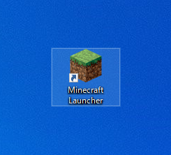
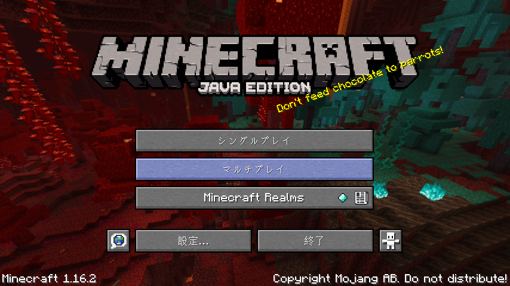
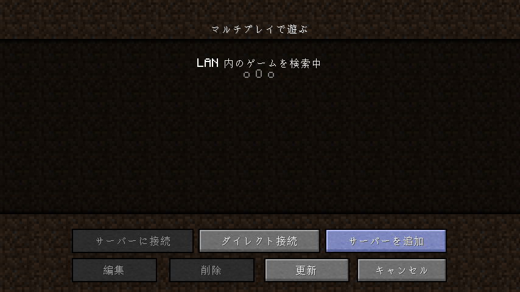
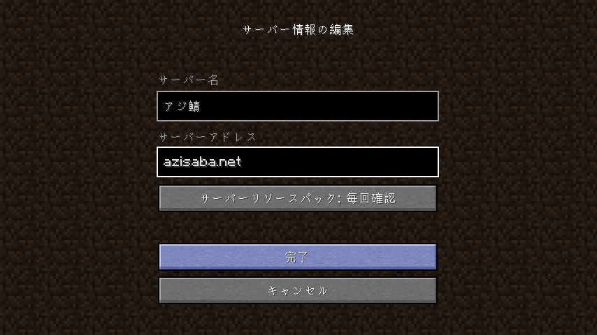
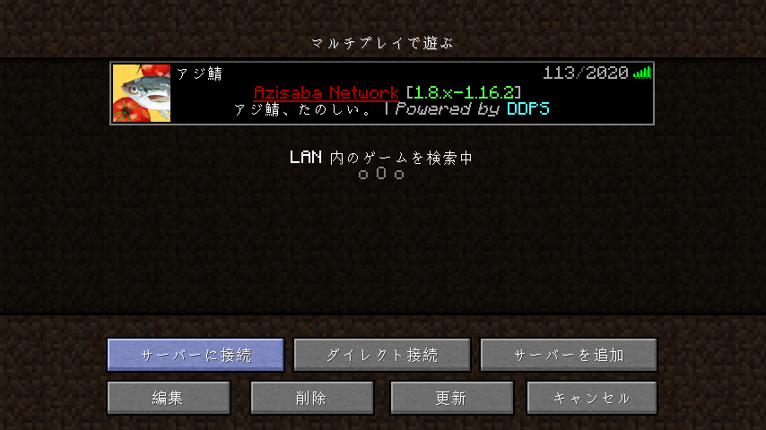

アジ鯖を楽しむために。

### 参加する前に...

- マインクラフトJava版の[🛒 購入](https://www.minecraft.net/ja-jp/store/minecraft-java-edition)が完了している必要があります。
- マインクラフトJava版の[📥 ダウンロードとインストール](https://www.minecraft.net/ja-jp/download)も完了している必要があります。
- ランチャーへのログインが完了している必要があります。

### 早速参加しよう！

1. マインクラフトJava版を起動します。

2. 起動したら`マルチプレイ`を選択します。

3. 右下の`サーバーを追加`を選択します。

4. **サーバー名**はお好きなものに変更し、**サーバーアドレス**を`azisaba.net`に変更し、完了！

5. 魚アイコンのアジ鯖が表示されるので、**選択してから**左下の`サーバーに接続`で接続しよう！！

### 接続できません

わかりました。

というか、分かっていました。

あなたのプレイ環境は少し特殊なようです。

ここに利用可能なサーバーアドレスの一覧があるのでぜひ試してみてください。

| サーバーアドレス | Aレコード付きアドレス |
| - | - |
| 54.250.163.61:35575 | ec2-54-250-163-61.ap-northeast-1.compute.amazonaws.com:35575 |
| 13.231.99.109:35575 | ec2-13-231-99-109.ap-northeast-1.compute.amazonaws.com:35575 |
| 54.199.141.66:35575 | ec2-54-199-141-66.ap-northeast-1.compute.amazonaws.com:35575 |
| 167.179.81.253:35575 | 167-179-81-253.azisaba.net:35575 |
| 202.182.123.235:35575 | 202-182-123-235.azisaba.net:35575 |
| 45.77.10.15:35575 | 45-77-10-15.azisaba.net:35575 |

### 接続できました！

楽しもう！
