どうもこんにちは、普段はアジ鯖開発者のゆきです。

マルチプレイできるサーバーが立てたい...

バニラだけじゃなく、プラグイン入れて機能追加したい...

少し前まではサーバーを自分でビルドしていましたが、Paperというものが登場しやり方も変わっているので改めて解説します！

### BukkitとSpigotについて

以前からマルチプレイ界隈で活躍していた、マインクラフトサーバーを改造した[Bukkit](https://dev.bukkit.org)というサーバーソフトウェアがあります。

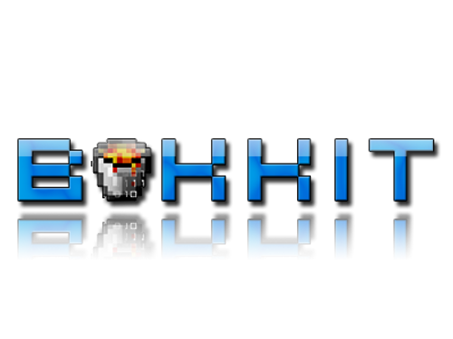

そしてそのBukkitに機能を追加して、パフォーマンスも優れた改良版の[Spigot](https://www.spigotmc.org)があります。

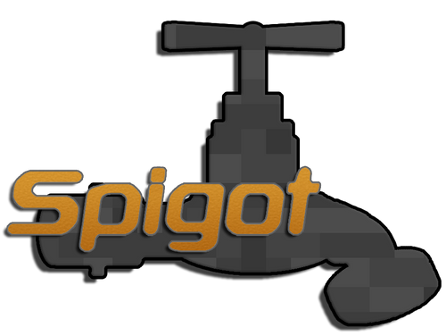

##### Bukkitの解散

時は2014年、Bukkit開発チームはマインクラフトサーバーの改造バージョンがMojangに公式に許可をもらっておらず、自信をもって配布することが出来なくなったとして、モチベ不足のためにプロジェクトを廃止することを[決めました](https://bukkit.org/threads/bukkit-its-time-to-say.305106/)。

##### Mojangによる乗っ取り

この発表後に、MojangがBukkitのプロジェクトを密かに所有していたことを明らかにして、BukkitプロジェクトをMojangが乗っ取りました。

##### DMCAテイクダウン

Bukkitチームの一人であるWolvereness氏は、Bukkitのソースコードまたはバイナリの配布を停止するか、GPLの配布条件に従うように提案します。

その後、同氏はDMCAテイクダウンを申請し、すべてのサイトからBukkitをダウンロード出来なくしました。 (GitHubから強制的に[CraftBukkit](https://github.com/Bukkit/CraftBukkit)や[Spigot](https://github.com/SpigotMC/Spigot)も消されてしまう)

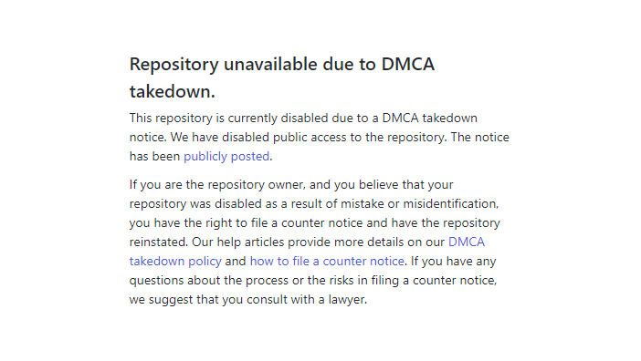

そしてSpigotもBukkitの改良バージョンのため、このDMCAテイクダウンの影響を受けることになります。

Spigot開発チームはWolvereness氏のコードを書き直すか、削除を受け入れるかに[迫られました](https://www.spigotmc.org/threads/our-dmca-response.28772/)。

##### BuildTools

そこでSpigotは[BuildTools](https://www.spigotmc.org/wiki/buildtools/)を開発し、パソコンでコンパイルさせることでこれを回避しました。 (天才かな？)

しかし、以前までは「ダウンロードするだけ」だったものが「環境を整えて自分でビルドする」というサーバー導入の手間がかかるようになってしまいました。

### Paperについて

そしてここで登場するのが[Paper](https://papermc.io)です！！

PaperはSpigotをさらに最適化し、多数のバグ修正を含んています。

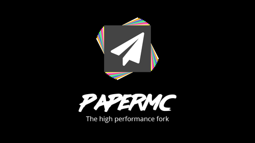

##### プラグインをそのまま使える

BukkitやSpigotで使えるプラグインと互換性があるので、ほとんどのユーザーがそのまま移行することが出来ます。便利

##### Paperclip

さらにPaperでは、[Paperclip](https://github.com/PaperMC/Paperclip)というバイナリパッチを生成してファイルに突っ込んで配布し、実行時にバニラサーバーにパッチを当てるというシステムを採用しています。

そのおかげで、前述の**著作権の問題を回避**し、**ビルド不要でダウンロードが可能**です！

これはもうPaperをダウンロードするしかないのでは！？

### まずはJavaをインストール！

ほら出た。

またインストールするだけでとんでもない時間かかるんだろと。いいや違います。

PaperはJavaで書かれているので動かすにはJavaが必要です。

そしてオラクルのサイトがログイン必須になってしまったので今回はOpenJDKを使用します！(重要)

##### Javaインストール手順

1. [AdoptOpenJDK](https://adoptopenjdk.net)のサイトにアクセスします。
2. `Choose a Version`の項目で`OpenJDK 8 (LTS)`を選択します。
3. 下の`Latest release`をクリックしてダウンロード開始！

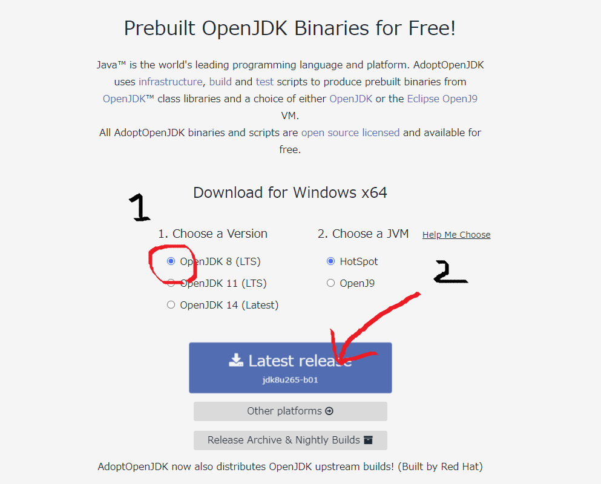

4. ダウンロードが終わったら起動します！適当にポチポチしてたら完了します。

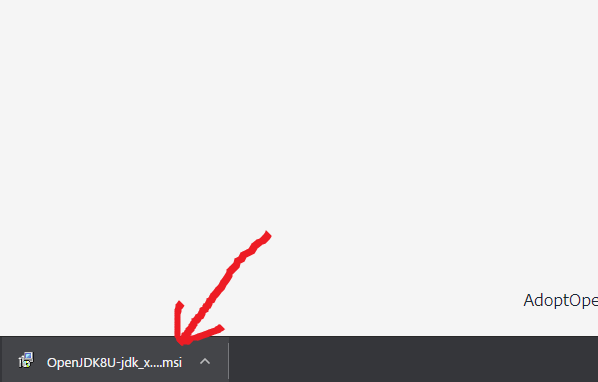

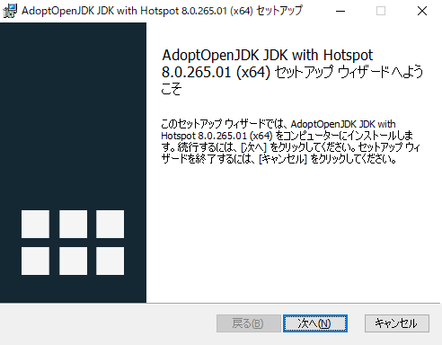

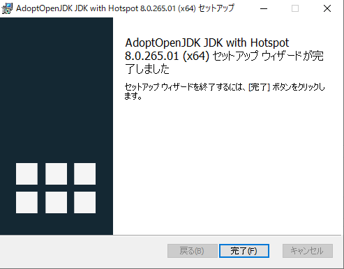

### そしてPaperをダウンロード！

1. Paper公式サイトの[ダウンロードページ](https://papermc.io/downloads)を開きます。
2. ダウンロードしたいファイルをクリックします。 (画像ではバージョン1.16.2用のサーバーをダウンロードしています！)

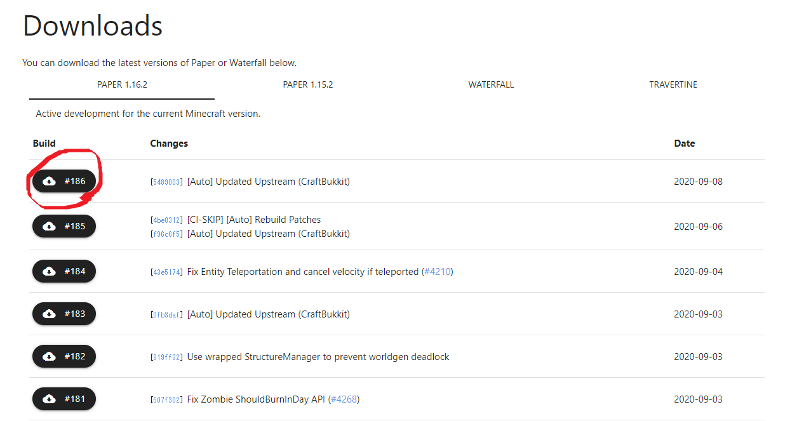

3. そしてダウンロードしたものを新しいフォルダに移動しよう！ (今回は`server`という名前にしました)

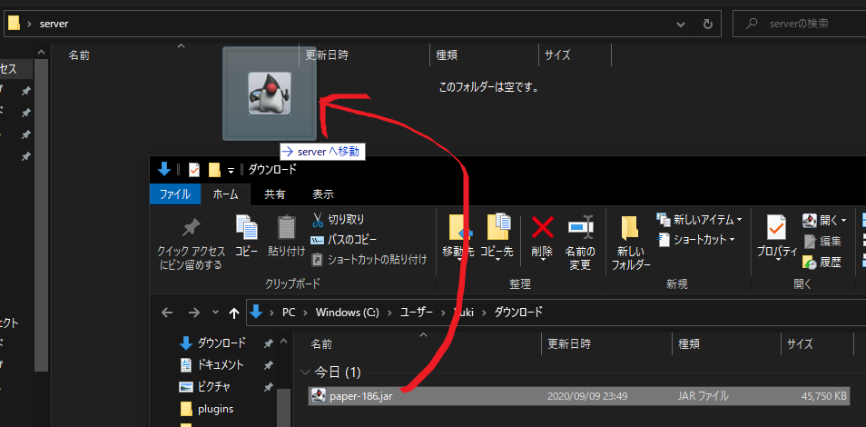

### ダブルクリックで起動可能にする

1. Paperと同じフォルダ内で右クリックして`新規作成`から`テキスト ドキュメント`を選択！

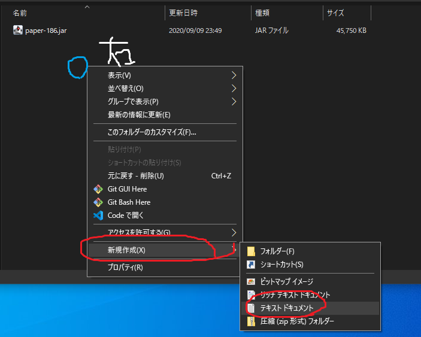

2. `start.bat`という名前に変更します。 (拡張子が`.bat`ならなんでもOK)

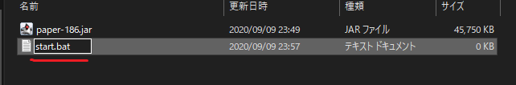

3. 作成した`start.bat`を右クリックして`編集`を選択します。

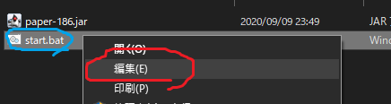

4. 以下の内容を入力します。 (`paper-186.jar`の部分を自分のPaperのファイル名と合わせよう！)

```batch
@echo off
java -Dcom.mojang.eula.agree=true -jar paper-186.jar nogui
```

5. 入力し終わったら、`Ctrl`キーと`S`キーを同時押しして保存してから閉じます！

### 早速起動してみるぜ？

1. `start.bat`を**ダブルクリック**します！

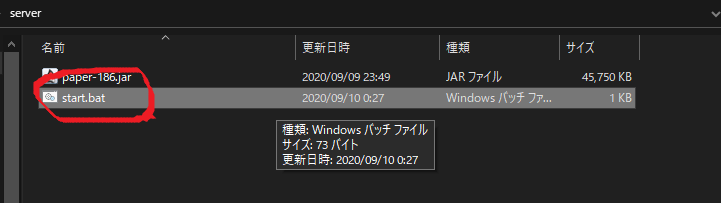

2. 勝手に起動します。`Done`と表示されれば完了！

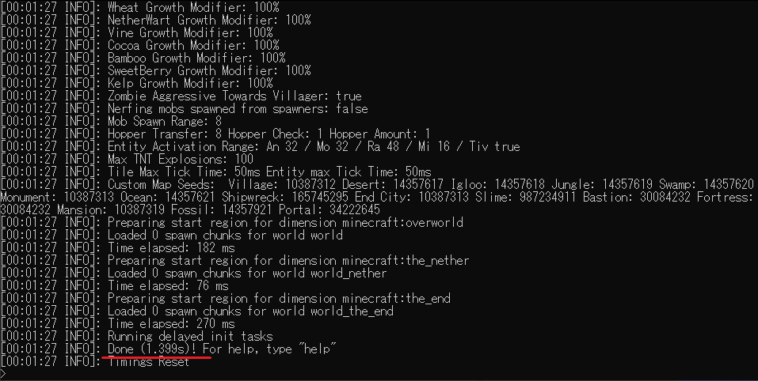

そしたらサーバーは一旦おいといて、マインクラフトを起動します。

マルチプレイからサーバーを追加し、サーバーアドレスに`127.0.0.1`を使用してください。

どうでしょうか？入れましたでしょうか？

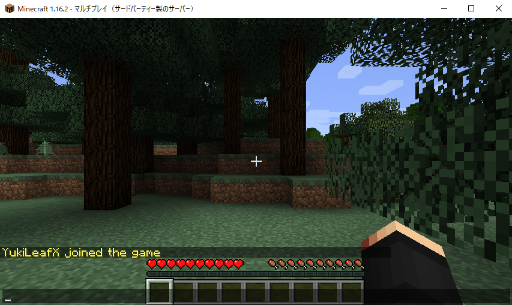

### まとめ

個人的には以前よりもサーバーのダウンロードから接続までが簡単になったように感じます。

もしうまくいかない場合は手順が間違っていないか確認しながらもう一度試してみてください！それではよいプラグインライフを！
