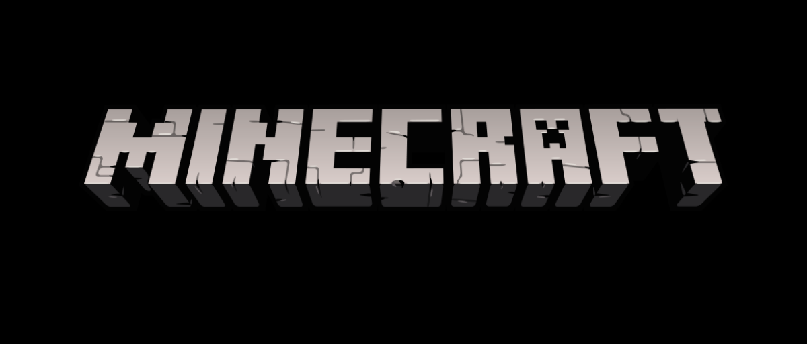

### 概要

このガイドラインではアジ鯖のルールについて詳しく書かれています。

また、ルールは話が通じないか他のプレイヤーに迷惑をかけている人を〆るためのものです。

普通にプレイしている人にはさほど大きな影響はありません。

### Minecraftサーバー内でのルール

| 該当の行為 | 処罰 | 期間 |
| - | - | - |
| チートの使用 | BAN | 永久 |
| [EULA](https://account.mojang.com/documents/minecraft_eula)違反 | BAN | 永久 |
| 運営のモチベーションを奪う | BAN | 永久 |
| 不法行為 (リソースパックを改変して再配布、寄付特典の売買や譲渡) | BAN | 3ヵ月 |
| 不利益となる行為 (他サーバーへの勧誘、ネガティブキャンペーン) | BAN | 2週間～3ヵ月 |
| バグの利用や拡散 | BAN | 1週間～3ヵ月 |
| 秩序を乱す行動 | BAN | 3日～2週間 |
| 秩序を乱す発言 (攻撃的な発言、差別的な発言、スパム、不適切な発言) | ミュート | 状況に応じて |
| 別アカウントで処罰を回避 | 同じ | 同じ |

##### 追加のポリシー
- チートの定義は**バニラのクライアントでできない挙動**とします。
- プレイヤー同士のトラブルは上記ルールのいずれかに該当する場合を除き、**一切関与しません**。
- 上記ルールとは別に、プラグインの関係で**警告が3回以上**に達すると**毎回1ヵ月のBANを受けます**。

### Discordサーバー内でのルール

- [Discordの利用規約](https://discord.com/terms)に準拠する。
- 適切なチャンネルで発言する。
- バグの利用や拡散をしない。
- 秩序を乱す行為をしない。 (攻撃的な発言、差別的な発言、スパム、不適切な発言)
- 不利益となる行為をしない。 (他サーバーへの勧誘、ネガティブキャンペーン)
- 運営のモチベーションを奪う行為をしない。

### 注意点

もう一つ重要なルールがあります。

**運営が不適切と判断した場合にも適切な処罰がされます。**

これは独裁などではなく、ルールの穴を突いたり、常識がまだ身についていない、イヤラシイ人のためのルールです。

このルールを適用する際は運営内で何度も審査されます。

概要にも書かれていますが、普通にプレイしている人は気にしなくてもいいルールです。
